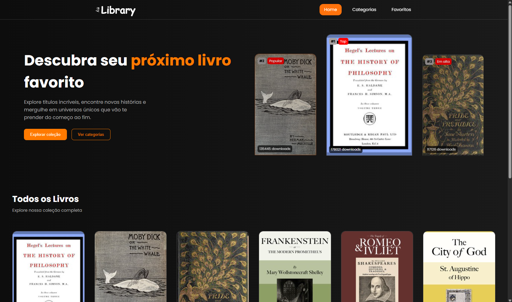
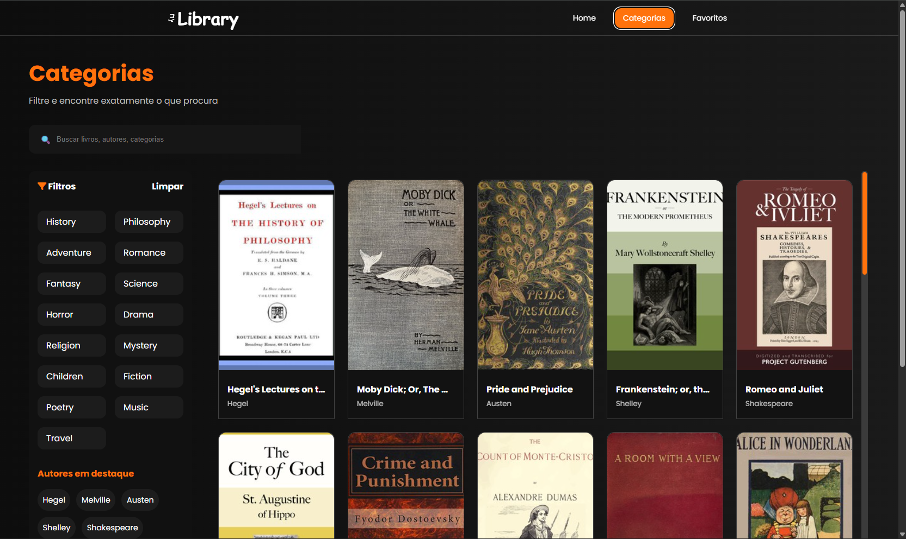
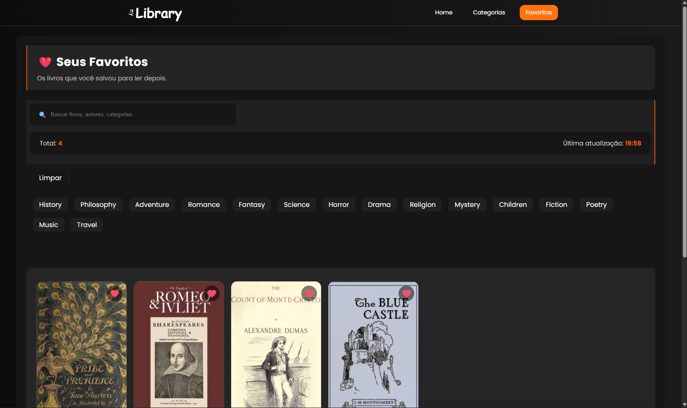
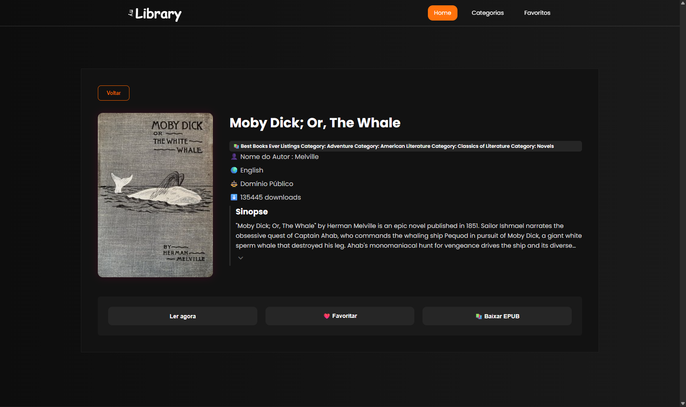

# myLibrary

Aplicação web de biblioteca desenvolvida para consumir uma API de livros e exibir informações dinâmicas e interativas.

## Status do Projeto

Projeto concluído (Versão 1.0)

## Preview do Projeto

| Página Inicial | Busca e Filtros |
|-------------------|-------------------|
|  |  |

| Área de Favoritos | Leitura, Download e Favoritos |
|----------------------|----------------------------------|
|  |  |

## Funcionalidades

### Biblioteca
- Listagem dinâmica de livros através de API
- Exibição de capa, autor, gênero e informações dos livros
- Visualização detalhada dos livros
- Atualização automática dos dados

### Pesquisa e Filtros
- Busca por título
- Busca por autor
- Filtro por gênero
- Atualização dinâmica dos resultados

### Sistema de Favoritos
- Adicionar e remover livros dos favoritos
- Página exclusiva para favoritos
- Filtro por gênero dentro dos favoritos
- Persistência de dados com LocalStorage

### Informações Dinâmicas
- Contador de livros
- Contador de favoritos
- Atualização automática das estatísticas

### Tratamento de Estados
- Tela de carregamento (Loading)
- Tratamento de erros de requisição da API
- Mensagens de feedback para estados vazios

## Tecnologias Utilizadas

- HTML5
- CSS3
- JavaScript (ES6+)
- Fetch API
- LocalStorage
- JavaScript Modules (Import/Export)

## Objetivo

Desenvolvimento de aplicação web completa para prática e consolidação de:

- Consumo de APIs REST
- Manipulação avançada do DOM
- JavaScript moderno e modularização
- Armazenamento local com LocalStorage
- Organização de projetos Front-End

## Conceitos Aplicados

- Async/Await
- Eventos e Manipulação de Classes
- Dataset e Manipulação de Arrays (`forEach`, `filter`, `some`, `includes`)
- Tratamento de erros assíncronos

---

Projeto desenvolvido por **João Paulo** como parte da jornada de aprendizado em Desenvolvimento Web.
